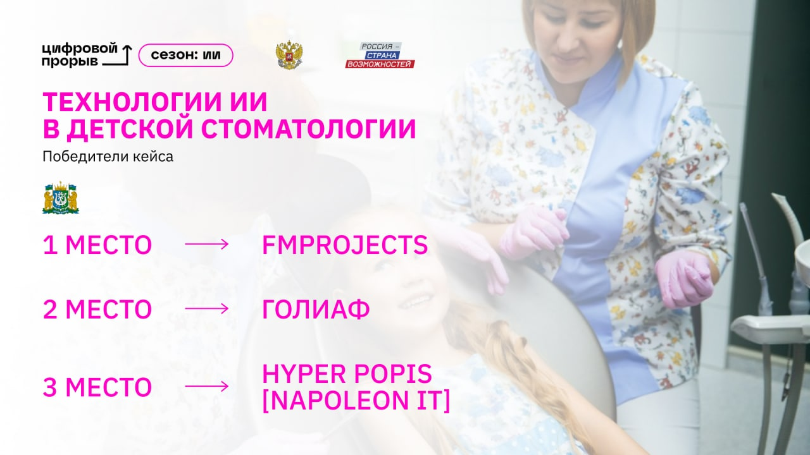
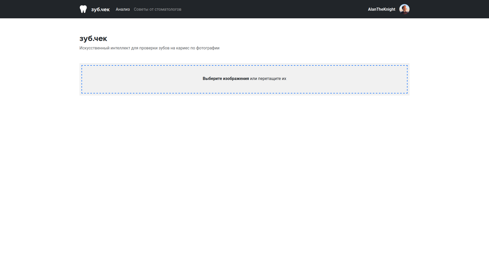
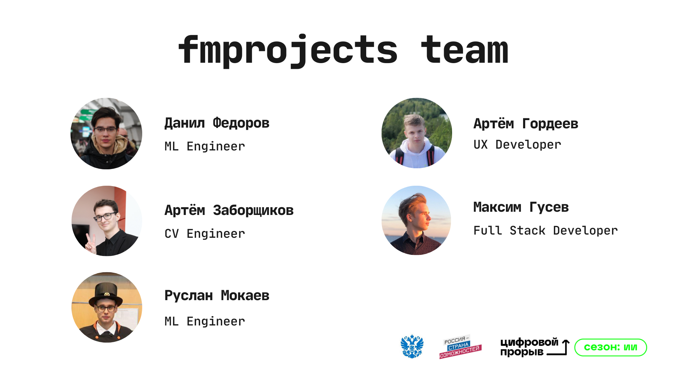

# зуб.чек

Искусственный интеллект для проверки зубов на кариес
по фотографии

## О проекте

Проект победителей окружного хакатона
"Цифровой прорыв. Сезон: искусственный интеллект",
проходившего в Екатеринбурге

Кейс: **Технологии ИИ в детской стоматологии** от
Правительства Ханты-Мансийского автономного округа-Югры

## Интерфейс

## Команда

